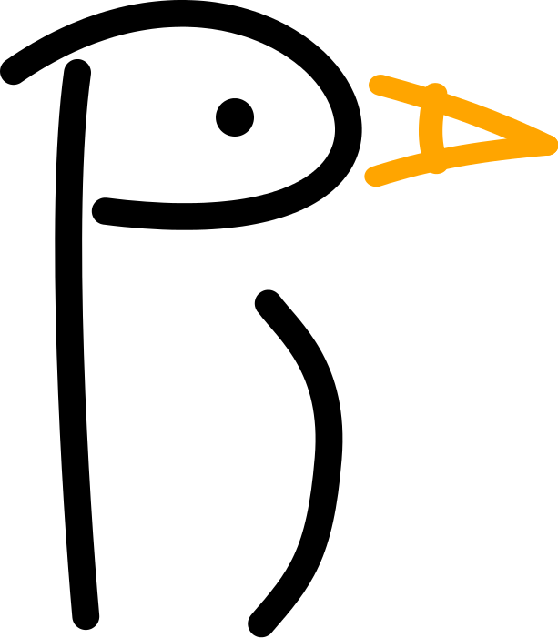
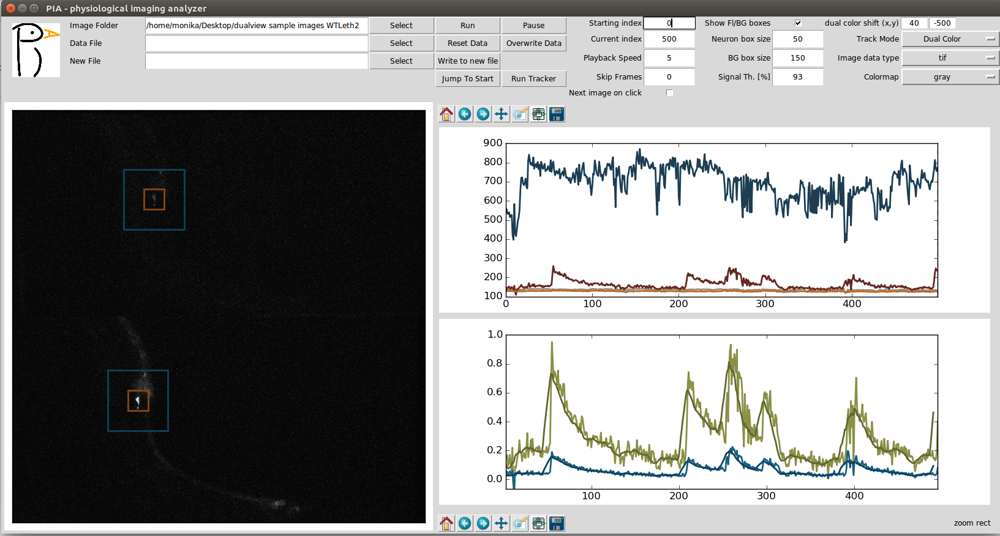
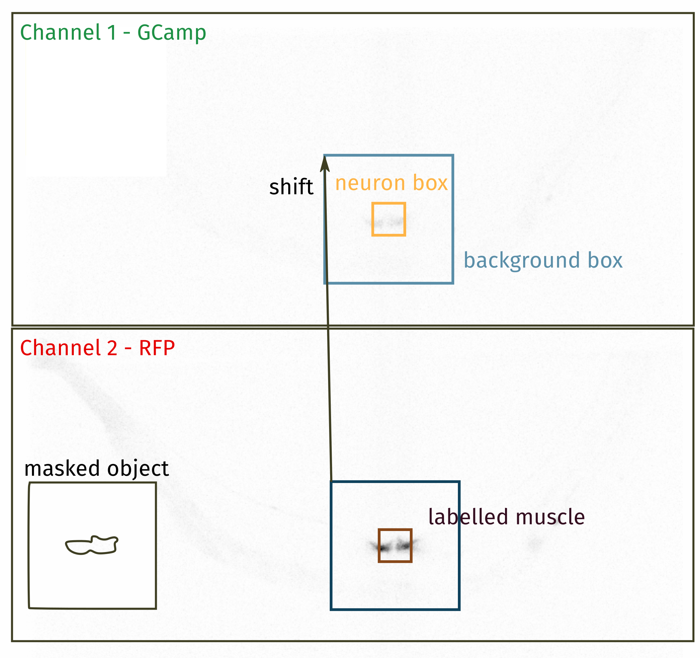

# PIA
- physiological imaging analyzer -


A graphical interface for tracking and correcting physiological calcium imaging (GCamp).
Integrates automatic and manual inputs to optimize the resulting calcium traces.


## Overview
PIA is designed to load image stacks, and assist in automated and/or manual analysis. The type of image PIA can analyze is either a fluorescently labelled spot (any shape) or a pair of spots that have a constant relative distance to each other. PIA can also deal with ratiometric images, where two fluorescence channels of the same object are shown. Requirements for this type of analysis is listed below.
The PIA output file contains the location of each tracked object (one or two objects), the brightness, the background level around the object and the area of the object.

## Features
PIA has 4 options for detecting fluorescence changes:
1. Tracking a single object over time (eg. traditional GCamp images)
2. Tracking two objects in the same arrangement (rotation and translation are ok)
3. Tracking an object in two colors and showing ratiometric changes
4. Tracking two objects with ratiometric changes.

PIA can also play a series of images at as a movie and load previous PIA data files and allow the user to manually correct/overwrite them.
The GUI is shown below with an example of 3. - Tracking an object in two colors and showing ratiometric changes. The current frame is shown in the left panel, and the right panel shows the tracked data: 
- The upper plot shows the raw fluorescence values for each object. The lowerobject is noticably brighter, which correspondingly shows up as higher values in the data (blue). The background is small and shows up as relatively flat curves in the bottom.

- the lower panel shows the ratiometric values: The green channel relative to background (blue curve) and the ratio between the two channels, each background subtracted (F1-Bg1)/(F2-Bg2). (green curve)



The plots can be directly saved by using the toolbar in the plotting windows. It is recommended to save the raw data and plot from there, since the curves are deliberately offset to create an easier visualization.
 
## Usage
*Object tracking* 
1. Download or clone the PIA repository
2. navigate to the directory and start PIA in a python console  ```bash python pia.py```
3. load an image stack by selecting an image folder. Check that the filetype matches the 'Image data type' set in the GUI.
  The left panel should show the first image of the stack.
4. adjust tracking modus and parameters as necessary (see Table below)
5. Click 'Run tracker' and use the mouse to click on the object to be tracked.
6. The program will automatically run through the stack. The data will live update while the tracker is running.
7. Save the result by selecting a new file ('New File') and click 'Write to new file'. Data will only be written if this button is clicked to avoid accidental overwriting!

*Correcting existing tracking data*
1. start PIA (see above)
2. load an existing image stack (point 3. above). The first image of the stack should appear on screen.
3. set the 'Track Mode' to the correct setting
4. load an existing PIA data file by selecting 'Data file'. The tracking curves should be displayed in the right window.
5. navigate to the frame(s) that require manual input by either changing the entry field 'Current index' or clicking on the top data plot.
6. Click on the neuron in the frame. The data entry will be updated.
7. If you need to return to the original data, click 'Reset Data'. This returns to the last saved version of the data.
8. Save the new data either to the existing file by clicking 'Overwrite data' or to a new file following point 7 above.

## Object detection and Tracking

### Image input
PIA uses matplotlib.image's imread function. Natively, this only supports png images, however, with the help of Pillow, it can also read tif and jpg images. The input images are expected to have a 4-digit timestamp at the end of the filename, eg. img_0001.jpg. 

### File output
The output file specifies four parameters for each object: Fluorescence, associated background, location in the image and area. Depending on the tracking mode, it returns this for one or two objects in one or two colors.
A typical output file looks like this:
```text
# #Frame BG1 F1 X1 Y1 A1 BG2 F2 X2 Y2 A2 BG3 F3 X3 Y3 A3 BG4 F4 X4 Y4 A4
0.000000 1110.811120 2196.681319 182.792300 263.916887 39892.000000 1.000000 1.000000 1.000000 1.000000 1.000000 1.000000 1.000000 1.000000 1.000000 1.000000 1.000000 1.000000 1.000000 1.000000 1.000000
```
Here, BG1, F1 etc. are the first objects Background, Fluorescene, X and Y location and Area, respectively. The next 5 values are for the green channel (if it exists)

Note: In the GUI, the values are displayed with smoothed overlays and sometimes artificially offset to create a better live visualization. The data are the raw brightness values as obtained from the analysis, and no offset, smoothing or subtraction has been performed. 

### Parameters
|Parameters     | Description | How to choose a value|
| ------------- |-------------| -------------|
| Background box| Determines the search area around a location where an object is expected. | Should be close to the maximally expected displacement in a frame|
| Neuron box    | This area will be masked for the background calculation and should cover the fluroescent object |Approximately the size of the object and any halo that might appear around it|
| Signal threshold| In percent pixel of the background box, this determines the threshold that separates object and background.| The percentile value of brightness ie. for 95% all pixels with the 5% highest brightness levels are part of the object|
| Dual color shift | Dual color(ratiometric) imaging offset | calculate from shift between images, should be constant for a movie and a microscope|



### Tracking
Tracking assumes that the object does not move extremly far within a frame. The size of the background box determines where the algorithm assumes the object will appear again. The automated tracking algorithm identifies the brightest object in the background box and assumes this is the desired object. The user can also click on or in the vicinity of the object to manually assist tracking. this is particularly useful if the object moved a lot between frames or if the sample was out of frame for a period of time. However, the exact determination of the objects location will still be done by the trackig algorithm, which will find the brightest object in the vicinity of the user's clicked location.


